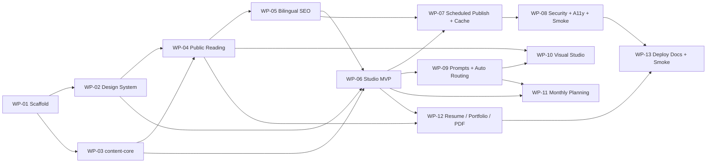

# nacianil.com — Work Packages INDEX

> Bu dosya, `nacianil.com` master planını (`nacianil-claude-code-prompt.md`) **sırayla çalıştırılabilir, bağımsız Claude Code chat'lerinde yürütülebilir** work package'lara böler.
> Master plan = tek doğruluk kaynağı (single source of truth). Bu dosyalar onu **uygulanabilir parçalara** çevirir; master planı tekrar etmez, ona referans verir (§N).
> Her WP ayrı bir chat'te başlatılır. Her WP dosyasının sonunda **"Claude Code start prompt"** vardır — kopyala, yeni chat'e yapıştır, başla.

---

## 0. Bu projede çalışma kuralları (her WP için geçerli)

Bu repo **OpenWolf** ile yönetiliyor. Her WP chat'i şu protokole uyar:

- Dosya okumadan önce `.wolf/anatomy.md`'yi kontrol et.
- Kod üretmeden önce `.wolf/cerebrum.md`'yi (özellikle `## Do-Not-Repeat`) oku.
- Bug/hata/başarısız test/başarısız build durumunda önce `.wolf/buglog.json`'a bak, düzeltince oraya yaz.
- Anlamlı her aksiyondan sonra `.wolf/memory.md`'ye bir satır ekle; dosya oluşturma/silme/yeniden adlandırmada `.wolf/anatomy.md`'yi güncelle.
- Bir düzeltme/öğrenme/kullanıcı tercihi → `.wolf/cerebrum.md`.
- Protokolün tamamı: `CLAUDE.md`, `.wolf/OPENWOLF.md`, `.claude/rules/openwolf.md`.

**Çalışma kökü:** `C:\dev\nacianilcom` = monorepo kökü (master plandaki `nacianil/`). `apps/`, `packages/`, `content/`, `docs/` doğrudan buraya kurulur. Master plandaki "boş `nacianil/` aç" notu bu repo köküne karşılık gelir; ayrı iç içe klasör açma.

---

## 1. Ön koşullar (planlamadan önce netleşmeli)

| Ön koşul | Nerede gerekli | Durum |
|---|---|---|
| **`<DASHBOARD_PATH>`** — referans portal dashboard projesinin gerçek yolu (announcement detail premium UX referansı, §5) | **WP-02 (zorunlu)** | **Çözüldü:** `C:\Users\anil.akman\source\repos\Portal` — duyuru detay: `Eroglu.HR.UI\UI\src\page\Dashboard\AnnouncementDetailPage.tsx`. Yol erişilemezse **DUR ve tek soru sor** (master plan §5/§32 Faz 1). |
| **`content/STYLE.md`** — yazar sesi/tonu | WP-06+ prompt'lar (opsiyonel) | Opsiyonel. Yoksa nötr akademik fallback (§19). Bloklamaz. |
| Secret/key (HMAC secret, Monthly Plan LLM API key) | WP-06 (HMAC), WP-11 (LLM key) | Yalnız local `.env` / Vercel server env. WP'ler `.env.example` üretir; gerçek değer kullanıcıdan. |

---

## 2. Uygulama sırası (önerilen lineer akış)

```
WP-01 ─▶ WP-02 ─┐
        WP-03 ─┴▶ WP-04 ─▶ WP-05 ─▶ WP-06 ─▶ WP-07 ─▶ WP-08 ─▶ WP-09 ─▶ WP-10 ─▶ WP-11 ─▶ WP-12 ─▶ WP-13
```

`WP-02` (design) ve `WP-03` (content-core) **birbirinden bağımsızdır**; ikisi de yalnız `WP-01`'e bağlıdır. Sırayı koruyabilir veya paralel/ters yapabilirsin. `WP-04` ikisini de bekler.



---

## 3. Work package listesi

| WP | Başlık | Faz (§32) | Amaç (tek satır) | Depends on | MVP? |
|---|---|---|---|---|---|
| **WP-01** | [Monorepo Scaffold](WP-01-scaffold.md) | Faz 0 | pnpm monorepo + app/paket iskeletleri + örnek `content/` | — | ✅ |
| **WP-02** | [Design System + Reference + UI + i18n](WP-02-design-system.md) | Faz 1 | light-only tokenlar, technical-writing bileşenleri, framework-light çekirdek + wrapper, messages, `design-reference.md` | WP-01 | ✅ |
| **WP-03** | [content-core](WP-03-content-core.md) | Faz 2 | zod şema, `isPublic`, `buildUrl`, `normalizeSlug`, taxonomy/internal-link/redirect, `runQC` + unit test | WP-01 | ✅ |
| **WP-04** | [Public Reading Experience](WP-04-public-reading.md) | Faz 3 | `[lang]` routing, seri landing + article + visual + technical-writing render | WP-02, WP-03 | ✅ |
| **WP-05** | [Bilingual SEO + URL + Redirects](WP-05-seo-sitemap-redirects.md) | Faz 4 | metadata, canonical/hreflang, JSON-LD, sitemap, RSS, OG, redirects | WP-04 | ✅ |
| **WP-06** | [Studio MVP](WP-06-studio-mvp.md) | Faz 5 | Draft Review + SEO/QC + Publisher + `/api/revalidate` (HMAC) + çekirdek prompt şablonları | WP-03, WP-02 (WP-04 önerilir) | ✅ |
| **WP-07** | [Scheduled Publish + Cache](WP-07-scheduled-publish-cache.md) | Faz 6a | cron + explicit `revalidatePath`/`revalidateTag` + 404-cache temizleme | WP-05, WP-06 | ✅ |
| **WP-08** | [Security Hardening + A11y/Perf](WP-08-security-hardening.md) | Faz 6b | CSP/security headers, secret/leak audit, Lighthouse 95+, smoke | WP-05 (WP-07 sonrası) | ✅ |
| **WP-09** | [Prompt Library + Auto Output Routing](WP-09-prompts-auto-routing.md) | Faz 7 | tam prompt seti + AI Output Inbox + auto-router + watcher | WP-06 | ⏳ |
| **WP-10** | [Visual Studio](WP-10-visual-studio.md) | Faz 8 | `.mmd→.svg` + SVG sanitize + visual-block validate + asset boyut | WP-06, WP-03, WP-04 | ⏳ |
| **WP-11** | [Monthly Editorial Planning](WP-11-monthly-planning.md) | Faz 9a | aylık plan modülü (25–40 aday → 10 plan), iki mod, `plans/YYYY-MM.json` | WP-06, WP-03 (WP-09 önerilir) | ⏳ |
| **WP-12** | [Resume / Portfolio / CV PDF](WP-12-resume-portfolio.md) | Faz 9b | `resume.json` (visibility), `/cv`, `/cv/print`, Playwright PDF, case-study | WP-04, WP-03, WP-06 | ⏳ |
| **WP-13** | [Deploy Docs + Smoke](WP-13-deploy-docs.md) | Faz 10 | README (§34), Vercel deploy, `pnpm audit` smoke script | Tümü | 🚀 |

✅ MVP-zorunlu · ⏳ MVP sonrası (planlı, ertelenebilir) · 🚀 canlıya çıkış için gerekli

---

## 4. MVP kapsamı

**MVP = canlı, scheduled-publish + güvenli bilingual public site (+ publish orchestration):**
`WP-01 → WP-02 → WP-03 → WP-04 → WP-05 → WP-06 → WP-07 → WP-08`, ardından canlıya çıkış için **WP-13**.

Bu, master plan §4 öncelik sırasını birebir karşılar: (1) content model + file contracts → WP-03; (2) public reading → WP-04; (3) SEO/GEO + scheduled publish → WP-05/WP-07; (4) studio preview/QC + publish orchestration → WP-06; (5) CV/portfolio → WP-12 (MVP sonrası).

**MVP sonrasına bırakılabilir (sırayla):**
- **WP-09** Prompt Library + Auto Output Routing — içerik üretim hızını artırır; public site bunsuz da çalışır.
- **WP-10** Visual Studio (Mermaid) — `Flow/Cycle/Timeline/ConceptMap` diyagramları; MVP'de custom React bloklar (Comparison/LayeredModel/Pyramid, WP-04) yeterli.
- **WP-11** Monthly Editorial Planning — editorial planlama; tek tek yazı akışı bunsuz çalışır.
- **WP-12** Resume / Portfolio / PDF — master planın §4 önceliği (5); ürün vizyonunun parçası ama içerik sitesinin canlıya çıkışını bloklamaz.

> Hızlı doğrulama: salt-okunur public site **WP-05 sonrası** Vercel'e deploy edilip test edilebilir. Tam README + smoke + Production Security Checklist **WP-13**'te tamamlanır.

---

## 5. Cross-cutting kararlar & çözülmüş çelişkiler (her WP'de saygı gör)

Master plandan çıkarılan, birden fazla WP'yi etkileyen sabit kararlar:

1. **`isPublic(meta, now)` tek kaynaktır** (§9 truth table). Tüm public yüzeyler (list, seri landing, article route, `generateStaticParams`, sitemap, rss, redirect/internal-link hedefi) aynı kuralı kullanır. Unit testle korunur (WP-03), her yerde uygulanır (WP-04/05/07). `draft` asla public; `scheduled & publishDate<=now` public; `published & publishDate>now` public değil.
2. **`packages/ui` framework-light'tır** (§3): `next/link`, `next/image`, `next/font` GİRMEZ. Web ince Next wrapper, Studio ince Vite wrapper kullanır. Studio preview "birebir RSC" değil, **fonksiyonel eşdeğer**.
3. **İçerik DB'siz**: MDX + JSON, Git'te versiyonlu. Firebase/Firestore yok (§2). SoT = dosya sistemi. Web yazmaz; yazma yolu = Studio commit/push → Vercel build (§10/§27).
4. **Mermaid build kısıtı** (§2/§15/§31): Vercel'de headless browser yok. `.mmd→.svg+sanitize+commit` **Studio'da local** (WP-10); web yalnız **commit edilmiş statik SVG okur** (render WP-04).
5. **SVG sanitize zorunlu ve CSP'den ayrıdır** (§15/§29): `<script>`, event handler, external ref, `foreignObject` yasak/whitelist. Sanitize failure → published'da **blocking QC**. Pipeline WP-10; QC kuralı WP-03'te tanımlanır; güvenlik checklist'i WP-08'de hatırlatılır.
6. **CSP/static gerçekliği** (§29): nonce tüm statik/ISR sayfalarda zorunlu DEĞİL; yalnız gerçekten dynamic uçlarda. Inline için kontrollü hash veya sınırlı `unsafe-inline`. **Report-Only → enforce** rollout. Dev gevşekliği prod'a taşınmaz. **Nonce + distributed rate-limit + KV/Redis MVP DIŞI** (DB-yok kararıyla uyumlu). In-memory nonce/rate-limit production security sayılmaz.
7. **`/api/revalidate` ve write/trigger uçları** (§29): **HMAC signature + dar timestamp window + method whitelist + zod input + safe error**. Endpoint WP-06; cron tüketimi WP-07.
8. **URL/dil** (§20): varsayılan TR; `/→/tr` redirect **yalnız `app/page.tsx`'te**; `next.config redirects()` **yalnız `content/redirects.json`**; `trailingSlash:false`; browser locale auto-redirect YOK. **TR/EN ortak `slugBase`** (bilinçli karar — hreflang/bakım kolaylığı; EN keyword-slug avantajından vazgeçilir).
9. **Redirect güvenliği** (§20/§29): yalnız site-içi relative public URL; absolute/external/open-redirect/loop/draft-scheduled hedef → **blocking**.
10. **`content/standalone/` MVP dışı** (§4): "reserved for future" — public route YAPILMAZ. MVP **seri-first**.
11. **Veri sızıntısı yasağı** (§28/§29/§30): draft/scheduled içerik + `private` resume alanları hiçbir public yüzeye (response/sitemap/rss/OG/JSON-LD/static output) sızmaz.
12. **Emoji / klişe AI giriş-sonuç / pazarlama-motivasyon dili YASAK** — hem içerikte hem UI metinlerinde (§0). Design: premium, editorial, **light-only**, dark theme YOK (§5).
13. **References blocking kuralı** (§18): `contentType` research/explainer/architecture veya `schemaType=TechArticle` → **0 referans blocking**; essay/cv/case-study → 0 referans yalnız **warning**.
14. **Studio asla deploy edilmez** (§28): `127.0.0.1` bind; LAN/public'e açılmaz; API key yalnız local `.env`.

---

## 6. Şema/sahiplik notu (tekrar üretimi önler)

- **Tüm zod şemaları WP-03'te tanımlanır** — `meta`, `series`, `references`, `taxonomy`, `redirects`, **`plans`** (WP-11 kullanır), **`inbox`** (WP-09 kullanır) dahil. Sonraki WP'ler şemayı yeniden tanımlamaz; `packages/content-core`'dan import eder.
- **`buildUrl` / `normalizeSlug` / `isPublic` / `runQC` / taxonomy & internal-link doğrulayıcı tektir** (content-core, WP-03). Hiçbir WP bunları kopyalamaz; çağırır.
- **`/cv`, `/cv/print`, `/work`, `/work/[caseSlug]` route'ları WP-12'de oluşturulur.** WP-04 yalnız `[lang]` layout + home + series/article route'larını kurar; WP-05 mevcut route'lara metadata verir, CV/work metadata'sı WP-12'de tamamlanır.
- **Visual-block presentational React bileşenleri (Comparison/LayeredModel/Pyramid + generic `VisualBlock`) WP-04'te** (render için gerekli). **Technical-writing bileşenleri (§16) WP-02'de.** **Mermaid pipeline + sanitize + validate WP-10'da.**

---

## 7. Her WP dosyasının ortak yapısı

Title · Purpose · Why this package exists · Depends on · Inputs/context to read · Files/folders likely to touch · Explicit non-goals · Implementation steps · Acceptance criteria · Required tests/checks · Commit message suggestion · Risks/gotchas · Handoff to next package · **Claude Code start prompt**.

Her WP kendi içinde gereken bağlamı tekrar eder (chat'ler arası memory kaybını önlemek için) ama master planı kopyalamaz — `nacianil-claude-code-prompt.md` §N'e referans verir.
